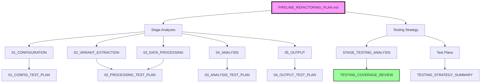

# VariantCentrifuge Pipeline Refactoring Documentation

## 📋 Document Index and Navigation Guide

This directory contains the complete refactoring plan for transforming the monolithic `pipeline.py` (2,831 lines) into a modular, testable, and parallel-capable architecture.

## 🗂️ Document Structure

### 📊 Main Refactoring Plan
- **[PIPELINE_REFACTORING_PLAN.md](../PIPELINE_REFACTORING_PLAN.md)** *(in parent directory)*
  - Master refactoring plan with architecture design
  - Defines PipelineContext, Stage pattern, and ParallelPipelineRunner
  - Timeline and implementation strategy

### 📈 Executive Summaries
- **[REFACTORING_SUMMARY.md](../REFACTORING_SUMMARY.md)** *(in parent directory)*
  - High-level overview of the refactoring
  - Performance improvements and success metrics
  - Risk mitigation strategies

- **[REFACTORING_CHECKLIST.md](../REFACTORING_CHECKLIST.md)** *(in parent directory)*
  - Step-by-step implementation checklist
  - Week-by-week breakdown
  - Progress tracking template

### 🔍 Stage Analysis Documents

These documents analyze the current monolithic code and design the refactored stages:

1. **[01_CONFIGURATION_STAGE_ANALYSIS.md](01_CONFIGURATION_STAGE_ANALYSIS.md)**
   - **Covers**: Lines 1387-1516 of pipeline.py
   - **Stages**: 6 configuration loading stages
   - **Key Feature**: All can run in parallel
   - **Test Plan**: [01_CONFIGURATION_STAGES_TEST_PLAN.md](testing/01_CONFIGURATION_STAGES_TEST_PLAN.md)

2. **[02_VARIANT_EXTRACTION_STAGE_ANALYSIS.md](02_VARIANT_EXTRACTION_STAGE_ANALYSIS.md)**
   - **Covers**: Lines 831-1216 of pipeline.py
   - **Stages**: Gene BED creation, variant extraction, BCF filtering
   - **Key Feature**: Parallel variant extraction by region
   - **Test Plan**: [02_PROCESSING_STAGES_TEST_PLAN.md](testing/02_PROCESSING_STAGES_TEST_PLAN.md)

3. **[03_DATA_PROCESSING_STAGE_ANALYSIS.md](03_DATA_PROCESSING_STAGE_ANALYSIS.md)**
   - **Covers**: Lines 1976-2147 of pipeline.py
   - **Stages**: Field extraction, genotype replacement, phenotype integration
   - **Key Feature**: Streaming operations for memory efficiency
   - **Test Plan**: [02_PROCESSING_STAGES_TEST_PLAN.md](testing/02_PROCESSING_STAGES_TEST_PLAN.md)

4. **[04_ANALYSIS_STAGE_ANALYSIS.md](04_ANALYSIS_STAGE_ANALYSIS.md)**
   - **Covers**: Lines 2216-2546 of pipeline.py
   - **Stages**: Annotations, inheritance, scoring, statistics
   - **Key Feature**: Chunked processing for large files
   - **Test Plan**: [03_ANALYSIS_STAGES_TEST_PLAN.md](testing/03_ANALYSIS_STAGES_TEST_PLAN.md)

5. **[05_OUTPUT_STAGE_ANALYSIS.md](05_OUTPUT_STAGE_ANALYSIS.md)**
   - **Covers**: Lines 2342-2773 of pipeline.py
   - **Stages**: Final filtering, reports, pseudonymization
   - **Key Feature**: Parallel report generation
   - **Test Plan**: [04_OUTPUT_STAGES_TEST_PLAN.md](testing/04_OUTPUT_STAGES_TEST_PLAN.md)

### 🧪 Testing Documentation

#### Overview Documents
- **[STAGE_TESTING_ANALYSIS.md](STAGE_TESTING_ANALYSIS.md)**
  - Maps existing tests to new architecture
  - Identifies ~40 reusable tests
  - Defines ~336 new tests needed

- **[TESTING_COVERAGE_REVIEW.md](TESTING_COVERAGE_REVIEW.md)**
  - Validates complete test coverage
  - Shows testing matrix for all 32 stages
  - Confirms 376 total tests planned

#### Detailed Test Plans
Located in the `testing/` subdirectory:

- **[testing/TESTING_STRATEGY_SUMMARY.md](testing/TESTING_STRATEGY_SUMMARY.md)**
  - Testing philosophy and principles
  - Implementation timeline
  - CI/CD integration

- **[testing/01_CONFIGURATION_STAGES_TEST_PLAN.md](testing/01_CONFIGURATION_STAGES_TEST_PLAN.md)**
  - 70 tests for 6 configuration stages
  - Covers parallel loading, path resolution, validation

- **[testing/02_PROCESSING_STAGES_TEST_PLAN.md](testing/02_PROCESSING_STAGES_TEST_PLAN.md)**
  - 115 tests for 10 processing stages
  - Covers external tools, streaming, parallel extraction

- **[testing/03_ANALYSIS_STAGES_TEST_PLAN.md](testing/03_ANALYSIS_STAGES_TEST_PLAN.md)**
  - 93 tests for 7 analysis stages
  - Covers DataFrame operations, inheritance, scoring

- **[testing/04_OUTPUT_STAGES_TEST_PLAN.md](testing/04_OUTPUT_STAGES_TEST_PLAN.md)**
  - 98 tests for 9 output stages
  - Covers reports, pseudonymization, parallel generation

## 🔗 Document Relationships

## 📋 Which Documents Do You Need?

### For Understanding the Architecture
1. Start with **PIPELINE_REFACTORING_PLAN.md**
2. Read **REFACTORING_SUMMARY.md** for overview
3. Review stage analyses (01-05) for detailed design

### For Implementation
1. Use **REFACTORING_CHECKLIST.md** as your guide
2. Follow stage analyses for specific components
3. Reference test plans while coding

### For Testing
1. Start with **TESTING_STRATEGY_SUMMARY.md**
2. Use specific test plans for each stage
3. Validate with **TESTING_COVERAGE_REVIEW.md**

## ✅ Document Necessity

**All documents serve specific purposes:**

- **Architecture Documents**: Define the new structure
- **Stage Analyses**: Detail the refactoring approach
- **Test Plans**: Ensure no regression
- **Summaries**: Provide quick reference

**No redundant documents** - each provides a unique perspective or level of detail necessary for successful refactoring.

## 🚀 Next Steps

1. Review the main refactoring plan
2. Set up the feature branch
3. Begin with core infrastructure (PipelineContext, Stage, Runner)
4. Implement stages following the analyses
5. Write tests according to the test plans
6. Track progress with the checklist

The documentation is comprehensive, well-linked, and ready to guide the refactoring effort.